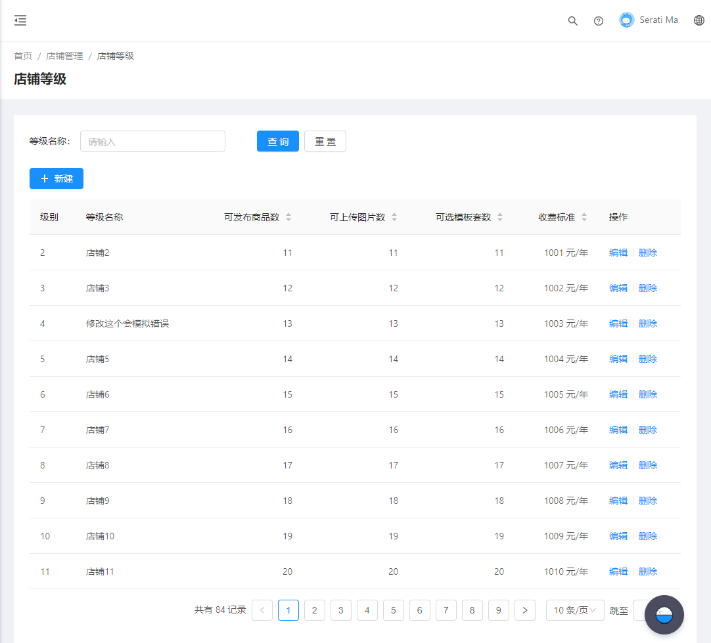
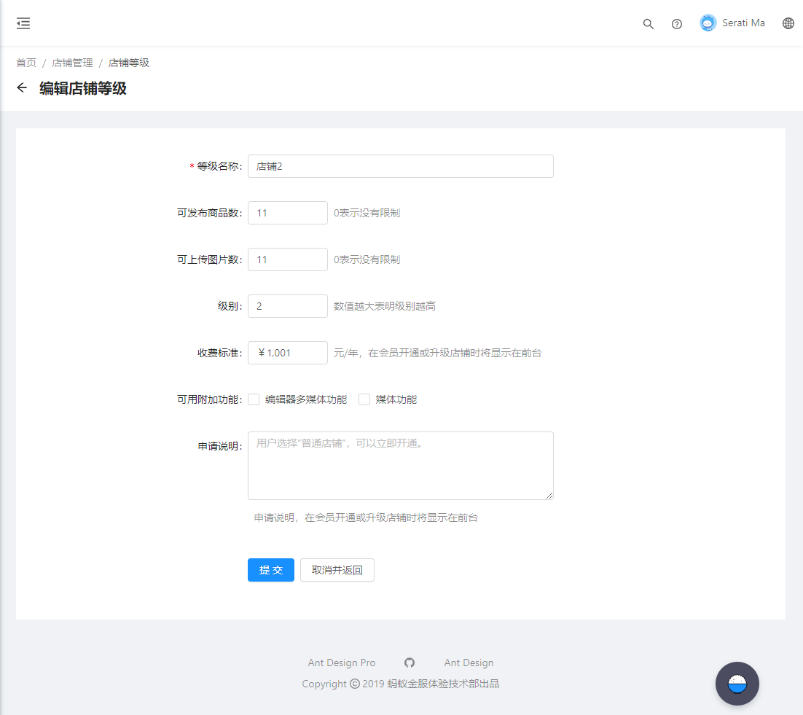
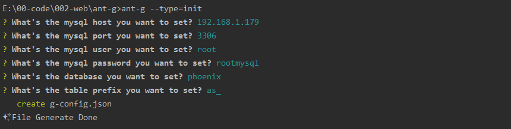
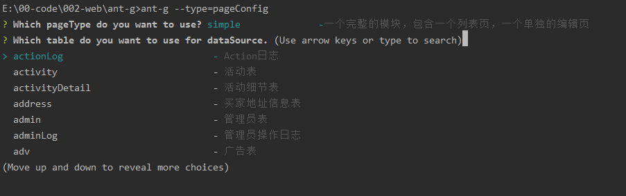
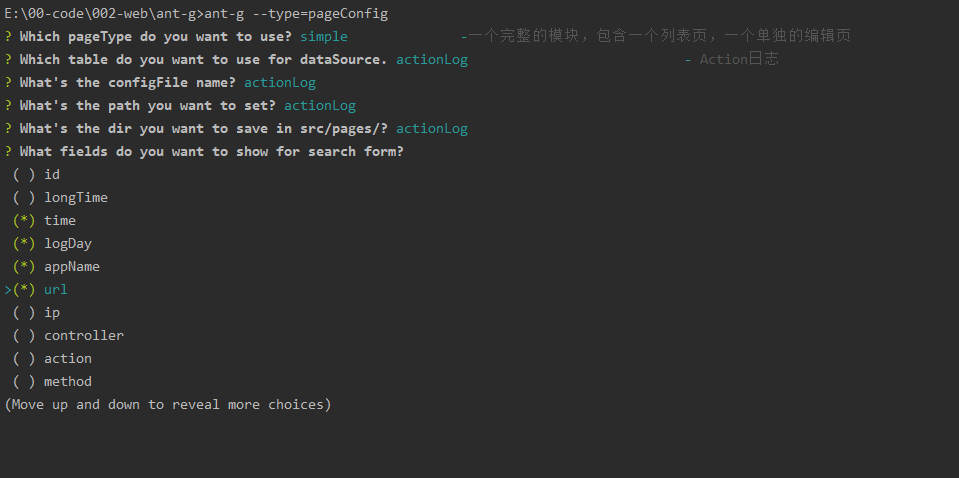
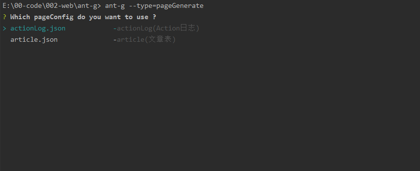

# 使用手册

可以连接数据库，并根据数据库的内容，生成相应的`mock`  `service` `model` `page`


# 0. 前言

> 例如要制作下面两个页面。 其中包含的功能有：

* 列表页

  * 检索条件
  * 结果表格

* 编辑页

  * 要编辑的字段。

  

> 如果要实现这个功能，需要做一下工作

* 编写mock
* 编写d.ts文件
* 编写service文件
* 编写model文件
* 编写页面文件。

后来发现，这些工作有些是重复，希望能通过代码自动生成。








# 1. 安装

```shell
#建立一个新目录，并进入这个目录

#生成antPro的框架
npm create umi
npm install
npm start

#安装脚手架
npm i -g ant-g

```


# 2. 初始化数据库连接

输入以下命令：

```shell
ant-g --type=init
```

输入要连接的数据库参数，其中`table prefix` 是表的前缀，如果没有可以为空。




下面给出了一个例子的SQL语句

```sql
create table as_activity
(
    activity_id         mediumint auto_increment comment '活动编号'  primary key,
    activity_title      varchar(255)                    not null comment '活动标题',
    activity_type       enum ('1', '2')                 null comment '活动类型^^1:商品 2:团购',
    activity_banner     varchar(255)                    not null comment '活动图片^^活动横幅大图片',
    activity_style      varchar(255)                    not null comment '活动模板^^活动页面模板样式标识码',
    activity_desc       varchar(1000)                   not null comment '活动描述',
    activity_start_date datetime                        not null comment '开始时间',
    activity_end_date   datetime                        not null comment '结束时间',
    activity_sort       tinyint(2) unsigned default 255 not null comment '排序',
    activity_state      tinyint(2) unsigned default 1   not null comment '活动状态^^0为关闭 1为开启'
)
    comment '活动' engine = InnoDB;
```


# 3. 下载数据库结构

将数据库结构保存到本地，这样就不用每次都连接数据库了。

输入以下命令：

```shell
ant-g --type=dataStructure
```

会将数据结构保存到：`.g/dataStructure.json`


# 4. 下载一些公用组件

输入以下命令：

```shell
ant-g --type=dependencies
```


# 5. 生成Service

输入以下命令：

```shell
ant-g --type=service
```

默认会为所有的Table生成对应的`Service`， 也可以修改`g-config.json` 指定有特定的表。

# 6. 生成Mock

输入以下命令：

```shell
ant-g --type=mock
```

默认会为所有的Table生成对应的`mock`， 也可以修改`g-config.json` 指定有特定的表。

# 7. 配置要生成的页面

输入以下命令：

```shell
ant-g --type=pageConfig
```


## 7.1 选择数据源




## 7.2 选择字段





# 8. 选择要生成的页面

输入以下命令：

```shell
ant-g --type=pageGenerate
```

选择要从那个配置文件生成页面，其中会提示是否自动将新页面加入到`antPro的菜单`

